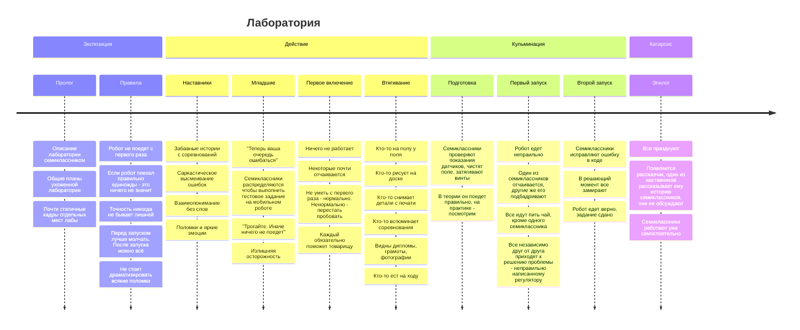

```mermaid
timeline
    title Лаборатория
    
    section Экспозиция
    Пролог : Описание лаборатории семиклассником 
           : Общие планы ухоженной лаборатории
           : Почти статичные кадры отдельных мест лабы
    Правила: Робот не поедет с первого раза
           : Если робот поехал правильно единожды - это ничего не значит
           : Точность никогда не бывает лишней
           : Перед запуском лучше молчать. После запуска можно всё
           : Не стоит драматизировать всякие поломки
    
    section Действие
    Наставники : Забавные истории с соревнований
               : Саркастическое высмеивание ошибок
               : Взаимопонимание без слов
               : Поломки и яркие эмоции
    Младшие : "Теперь ваша очередь ошибаться"
            : Семиклассники распределяются чтобы выполнить тестовое задание на мобильном роботе
            : "Трогайте. Иначе ничего не поедет"
            : Излишняя осторожность
    Первое включение : Ничего не работает
                     : Некоторые почти отчаиваются
                     : Не уметь с первого раза - нормально. Ненормально - перестать пробовать
                     : Каждый обязательно поможет товарищу
    Втягивание : Кто-то на полу у поля
               : Кто-то рисует на доске
               : Кто-то снимает детали с печати
               : Кто-то вспоминает соревнования
               : Видны дипломы, грамоты, фотографии
               : Кто-то ест на ходу

    section Кульминация
    Подготовка: Семиклассники проверяют показания датчиков, чистят поле, затягивают винты
              : В теории он поедет правильно, на практике - посмотрим
    Первый запуск: Робот едет непраильно
                 : Один из семиклассников отчаивается, другие же его подбадривают
                 : Все идут пить чай, кроме одного семиклассника
                 : Все независимо друг от друга приходят к решению проблемы - неправильно написанному регулятору
    Второй запуск: Семиклассники исправляют ошибку в коде
                 : В решающий момент все замирают
                 : Робот едет верно, задание сдано
    
    section Катарсис
    Эпилог: Все празднуют
          : Появляется рассказчик, один из наставников рассказывает ему историю семиклассников, они ее обсуждают
          : Семиклассники работают уже самостоятельно
```
